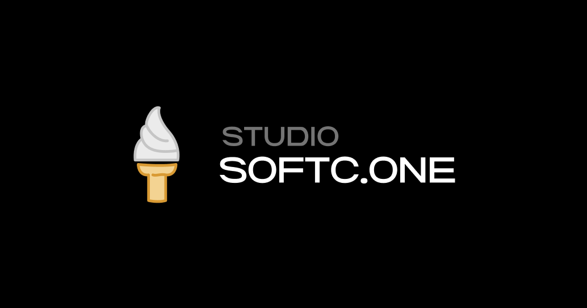

# SOFTC.ONE 블로그 백엔드

소프트콘 블로그를 위한 Strapi로 구성된 백엔드 입니다. 해당 백엔드는 `aws`에 배포되어 있습니다.

> https://api.softc.one/

 

## ⌨️ 스택

- strapi + nginx
- node.js
- aws ec2

 

## 📝 배포

- `master` 브랜치에 푸시 후 `ec2` 서버에서 `git pull`
- `ec2`에서 `yarn build` 후 `yarn start`로 서버 실행
